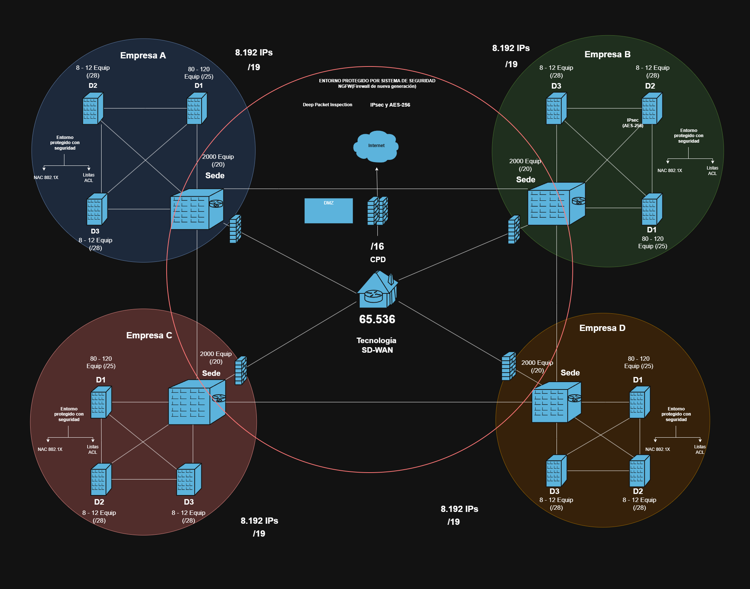
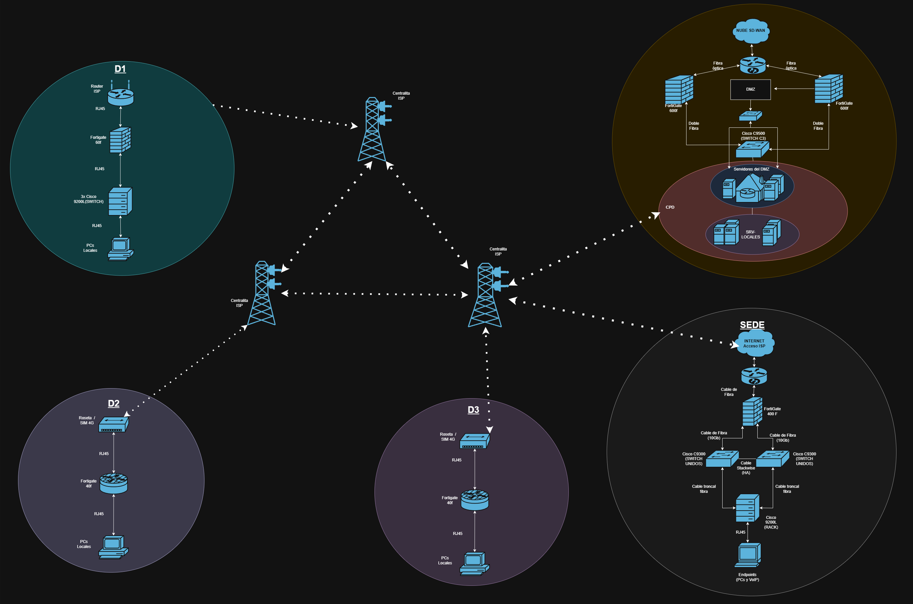

# 🏢 Arquitectura de Red Corporativa Multisite (SD-WAN & Zero-Trust)

## 📌 Visión General
Diseño teórico e implementación lógica de una infraestructura de red escalable y segura para un conglomerado multinacional compuesto por 4 empresas independientes y un Centro de Procesamiento de Datos (CPD) Central. 

El proyecto resuelve el desafío arquitectónico de unificar el transporte WAN y la salida a Internet, garantizando un aislamiento estricto (Zero-Trust) entre los distintos dominios corporativos.

## ⚙️ Tecnologías y Protocolos Core
* **Routing LAN:** Single-Area OSPFv2 (Área 0) securizado mediante interfaces pasivas y adyacencias Unicast.
* **Routing WAN:** eBGP sobre túneles IPsec (SD-WAN Overlay) aplicando sumarización estricta de rutas.
* **Seguridad Perimetral:** Fortinet FortiGate (NGFW), NAT centralizado (Forced Tunneling) y políticas de inspección.
* **Switching L3:** Entornos Cisco Catalyst, ACLs extendidas y segmentación inter-VLAN.

## 🗺️ Topología de Red

### Topología Lógica (SD-WAN Overlay)
*(Esquema de interconexión BGP, zonas de seguridad y distribución de los bloques /19).*

### Topología Física (Underlay y Conexiones)
*(Detalle de conmutación L3, cableado troncal, clústeres FortiGate y DMZ).*

## 📂 Estructura de la Documentación

La documentación técnica de este diseño se divide en tres bloques fundamentales:

1. **[Topología y Direccionamiento IP](1-direccionamiento.md)**
   * Estrategia de asignación de bloques `/19` para filiales.
   * Direccionamiento WAN (`/29`) y segmentación en 3 zonas críticas (Servidores Locales, Cloud AWS y DMZ).

2. **[Enrutamiento Dinámico (OSPF & BGP)](2-enrutamiento-ospf-bgp.md)**
   * Inyección de rutas por defecto y convergencia local con OSPF.
   * Interconexión de sedes mediante eBGP y optimización de tablas de enrutamiento mediante sumarización.

3. **[Políticas de Seguridad y NAT](3-seguridad-fortigate.md)**
   * Aislamiento multinacional mediante Zero-Trust en interfaces virtuales.
   * Reglas de Source NAT (PAT) y Destination NAT (VIPs) en CPD Central.
   * Blindaje unidireccional de la Zona Desmilitarizada (DMZ).
     
4. **[Anexo A: Tablas de Direccionamiento y Subnetting](4-anexo-subnetting-vlans.md)**
   * Desglose completo de rangos de IPs, VLANs y gateways para las sedes y todas sus delegaciones (Empresas A, B, C y D).
     
5. **[Anexo B: Tablas de Enrutamiento (Routing Tables)](5-anexo-tablas-enrutamiento.md)**
   * Documentación del salto a salto: rutas estáticas, inyecciones OSPF y sumarización BGP en los equipos Core.
     
## 🚀 Próximas Fases (Roadmap)
* Automatización del despliegue de infraestructura base (IaC) mediante la creación de módulos y providers en Terraform.
* Migración de servicios internos hacia instancias EC2 y conectividad VPN Site-to-Site nativa con AWS.
